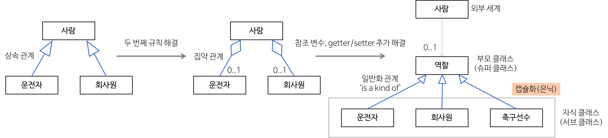

## 객체지향이란?

 

객체 지향 프로그래밍은 실제 세계가 객체들로 구성되어 있는 것과 비슷하게 소프트웨어도 객체 단위로 작성하는 방법을 얘기한다.

소프트웨어를 작성할 때에 객체를 조립하듯이 하는 기법으로, 구조적 기법의 문제점으로 인한 소프트웨어 위기의 해결책으로 제시됐다.

객체 지향 프로그래밍은 소프트웨어의 재사용 및 확장성을 높이고 유지보수를 용이하게 만들었다.

 

## 객체 지향 프로그래밍의 구성 요소

 

### 객체:

**객체(모듈)**: 데이터 + 데이터를 처리하는 함수

**데이터**: 객체가 가지고 있는 정보. 속성. 상태. 분류

**데이터 처리 함수**: 객체가 처리하는 기능. 객체의 상태를 참조하거나 변경(= 메소드, 서비스, 동작, 연산)

### 추상화:

* 사물들의 공통된 특징, 즉 추상적 특징을 파악해 인식의 대상으로 삼는 행위를 말한다.
* 구체적인 사물들의 공통적 특징을 파악해 이를 하나으 ㅣ개념으로 다루는 수단
  
#### 구체적인 개념에 의존하는 경우 

    switch(자동차 종류)

    case 아우디: // 아우디 엔진 오일을 교환하는 과정을 기술

    case 벤츠: // 벤츠 엔진 오일을 교환하는 과정을 기술

    case BMW: // BMW 엔진 오일을 교환하는 과정을 기술

    ... 새로운 종류의 자동차가 나오면 계속해서 추가해야 한다.

    end switch

#### 추상적인 개념에 의존하는 경우 

    void changeEngineOil(Car c) {
      c.changeEngineOil(); // 추상 메서드
    }

* changeEngineOil의 인자로 아우디, 벤츠의 추상화 개념인 “Car”을 사용한다.
* 이 코드는 어떤 새로운 종류의 자동차가 나와도 변경할 필요가 없다.

* 뒤에서 다룰 ‘다형성’의 원리에 따라 각 구체적인 클래스에서 오버라이드된 메서드(changeEngineOil)를 호출한다.

### 클래스:

* 공통된 속성과 연산을 갖는 객체의 집합
* 객체들이 갖는 속성과 연산을 정의
* Instance: 클래스에 속한 객체
* Instantiation: 클래스로 새로운 객체를 생성하는 것
  
### 메시지

대부분의 프로그램은 여러개의 객체를 가지고 있고, 작업은 이 객체들의 상호 작용으로 이루어지며, 객체들이 다른 것들과 상호작용하기 위해서는 어떤 종류의 통신 메커니즘을 필요로 한다.

* 객체간의 상호작용 시에 사용되는 수단으로 외부에서 메소드를 사용할때 필요로하는 요구사항
* 객체 지향 환경에서 메시지 전달은 "메소드 호출"로 구현된다. 즉, 객체가 다른 객체로 메시지를 보낼 때, 실제로는 다른 객체의 메소드를 호출하는 것이다.

    ex) 
        Car.setSpeed(100); 라는 코드가 있다고 하자.

        Car = 메시지를 받는 객체 = Car 라는 이름을 가진 클래스에서

        setSpeed = 메시지의 이름 = setSpeed 라는 이름을 가진 메소드(기능)을 사용하여

        (100) = 메시지의 매개변수 = 100 이라는 값을 주어라

## 객체지향 프로그래밍의 원칙

 

### 캡슐화

#### 높은 응집도와 낮은 결합도록 유지할 수 있도록 설계해야 요구사항을 변경할 때 유연하게 대처할 수 있다.

* 응집도(Cohesion): 클래스나 모듈 안의 요소들이 얼마나 밀접하게 관련되어 있는지를 나타낸다.
* 결합도(Coupling): 어떤 기능을 실행하는 데 다른 클래스나 모듈들에 얼마나 의존적인지를 나타낸다.

 

#### 캡슐화는 낮은 결합도 를 유지할 수 있도록 해주는 객체지향 설계 원리다.

* 캡슐화는 정보 은닉을 통해 높은 응집도와 낮은 결합도를 갖도록 한다.
    
    * 정보 은닉(information hiding)

        * 필요가 없는 정보는 외부에서 접근하지 못하도록 제한 하는 것
        * private 키워드
    * 정보 은닉이 왜 필요할까?

        * 소프트웨어는 결합이 많을 수록 문제가 발생한다.
        * 한 클래스가 변경이 발생하면 변경된 클래스의 private info에 의존하는 다른 클래스들도 변경해야 할 가능성이 커진다는 뜻이다.
  

#### 캡슐화는 신뢰할 수 있는 코드의 재사용을 가능하게 하는 기법이다.

캡슐화는 데이터와 알고리즘을 캡슐에 넣어서 포장한다는 의미이다. 객체 지향에서는 이 캡슐을 클래스라고 부른다.

만약 자기가 필요로 하는 클래스가 다른 사람에 의해 작성되어 이미 존재한다면 언제든지 가져다가 사용할 수 있다. 또 이 클래스는 이미 그 방면의 전문가가 테스트, 디버깅을 마쳤기 때문에, 안심하고 사용 가능하다. 

누구나 함부로 객체 내부 데이터를 수정할 수 있따면 또 다른 사람이 객체를 사용할 때 문제가 생기기 때문에, 캡슐화는 또한 내부 데이터를 캡슐로 보호하는 역할도 한다. 이것을 정보 은닉이라고 부른다.

객체의 내부 데이터를 보호하고, 사용자에게는 개체가 제공하는 메소드를 통하여 접근토록 해놓은 것이다.

### 상속(일반화 관계)

상속은 기존의 코드를 재활용하기 위한 기법으로 이미 작성된 클래스(부모 클래스 = 수퍼 클래스)를 이어 받아서 새로운 클래스를 생성하는 기법이다.

자식 클래스는 부모 클래스의 모든 속성과 기능을 물려 받는다.

다른 사람의 클래스를 상속 받아서 자신이 필요한 부분을 변경하여서 사용하면 된다.

* 다중상속: 하나의 클래스로부터 상속되는 것이 일반적이지만 다수개의 클래스로부터 상속 받아 새로운 클래스를 생성하는 경우

 

### 위임

#### is a kind of 관계가 성립되지 않는 일부 기능만을 재사용하고싶을 경우에 사용된다.

    public class MyStack<String> extends ArrayList<String> {
        public void push(String element) { add(element); }
        public String pop() { return remove(size() - 1); }
    }

ArrayList의 isEmpty, size, add, remove 등의 메서드를 자신이 구현하지 않고 그대로 사용할 수 있다.

그러나 ArrayList 클래스에 정의된 Stack과 전혀 관련 없는 수많은 연산이나 속성도 같이 상속받게 된다.

* 자신이 직접 기능을 실행하지 않고 다른 클래스의 객체가 기능을 실행하도록 위임하는 것
* 일반화 관계는 클래스 사이의 관계지만 위임은 객체 사이의 관계다.
* 즉 기능을 재사용할 때는 위임을 이용하는 것이 좋다.
  
#### 위임을 상속대신 사용하는 과정

위의 잘못된 일반화 예시 코드를 수정하는 과정

    public class MyStack<String> extends ArrayList<String> {
      public void push(String element) { add(element); }
      public String pop() { return remove(size() - 1); }
    }
1) 부모 클래스의 인스턴스를 참조하는 속성(this)을 만들고
2) 위임 속성 필드를 참조하도록 변경한다.

       public class MyStack<String> extends ArrayList<String> {
           // 1. 부모 클래스의 인스턴스를 참조하는 속성(this)
           private ArrayList<String> arrayList = this;
           // 2. arrayList.~ 추가
           public void push(String element) { arrayList.add(element); }
           public String pop() { return arrayList.remove(size() - 1); }
       }

3) 일반화 관계를 제거하고 슈퍼 클래스 객체를 생성 후 대입한다.
4) 자식 클래스에서 사용된 부모 클래스의 메서드에도 위임 속성 필드를 참조하도록 변경한다.
        
        // 3. 일반화 관계 제거
        public class MyStack<String> {
        // 3. 슈퍼 클래스 객체를 생성 후 대입
        private ArrayList<String> arrayList = new ArrayList<String>();
        // 동일
        public void push(String element) { arrayList.add(element); }
        public String pop() { return arrayList.remove(size() - 1); }
        // 4. 사용된 메서드 추가 및 위임 속성 필드를 참조하도록 변경
        public boolean isEmpty() { return arrayList.isEmpty(); }
        public int size() { return arrayList.size(); }
        }

### 다형성

다형성이란 객체가 취하는 동작이 상황에 따라 달라지는 것을 말한다.

예를 들어 말하다 라는 기능을 가진 부모 클래스를 상속받아서 개, 고양이 등의 자식 클래스를 만들었다면, 말하다 라는 기능을 사용했을 때, 각각 '멍멍', '야옹' 이라는 결과를 낼 수 있다.

### 피터 코드의 상속 규칙

상속의 오용을 막기 위해 상속의 사용을 엄격하게 제한하는 규칙들

* 5가지 규칙 중 어느 하나라도 만족하지 않는다면 상속을 사용해서는 안된다.
  * 자식 클래스와 부모 클래스 사이는 ‘역할 수행’관계가 아니어야 한다.
  * 한 클래스의 인스턴스는 다른 자식 클래스의 객체로 변환할 필요가 절대 없어야 한다.
  * 자식 클래스가 부모 클래스의 책임을 무시하거나 재정의하지 않고 확장만 수행해야 한다.
  * 자식 클래스가 단지 일부 기능을 재사용할 목적으로 유틸리티 역할을 수행하는 클래스를 상속하지 않아야 한다.
  * 자식 클래스가 ‘역할’, ‘트랜잭션’, ‘디바이스’ 등을 특수화해야 한다.

&nbsp;&nbsp;&nbsp;&nbsp;&nbsp;

        참조: 
        https://gmlwjd9405.github.io/2018/07/05/oop-features.html
        https://aristatait.tistory.com/10
        https://emzei.tistory.com/209
        https://aventure.tistory.com/56